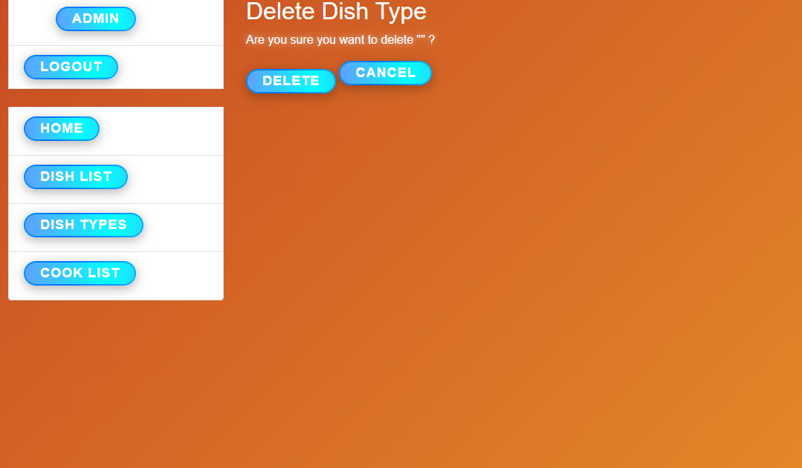

# Restaurant Kitchen Service

This is a Django-based web application for managing a restaurant's kitchen service.
It allows users to manage dishes, cooks, and their details.

## Features
- User authentication with login required for all views
- CRUD operations for Dishes
- CRUD operations for Cooks
- Custom login functionality with a "remember me" option
- Homepage displaying the total number of dishes

## Technologies Used
- Django
- Django ORM
- SQLite (default database)

## Installation
1. Clone the repository:
   ```sh
   git clone https://github.com/Professor-Douel/Restaurant-kitchen-service.git
   cd restaurant-kitchen-service
   ```
2. Create a virtual environment and activate it:
   ```sh
   python -m venv venv
   source venv/bin/activate  # On Windows use: venv\Scripts\activate
   ```
3. Apply database migrations:
   ```sh
   python manage.py makemigrations
   python manage.py migrate
   ```
   ```sh
   To populate a database with data from a file data.json:
   python manage.py loaddata data.json
   ```
4. Use Username: admin
       Password: 1qazcde3
   OR
   Create a superuser (admin account):
   ```sh
   python manage.py createsuperuser
   ```
   Follow the prompts to create an admin account.
5. Run the development server:
   ```sh
   python manage.py runserver
   ```
6. Open your browser and navigate to:
   ```
   http://127.0.0.1:8000/
   ```
7. To use staticfiles
   ```sh
   python manage.py collectstatic
   ```

## Usage
- Log in with your credentials.
- Navigate to the dishes list, dish details, and create/update/delete dishes.
- Navigate to the cooks list, cook details, and create/update/delete cooks.
- Admin users can manage all objects via Django's built-in admin panel at `/admin/`.

## Testing
To run the test suite:
```sh
python manage.py test
```

## Project Structure
```
restaurant-kitchen-service/         # Django project
│-- __init__.py                     # File for initializing
│-- asgi.py                         # Asynchronous Server Gateway Interface
│-- settings.py                     # Settings of the project
│-- urls.py                         # Routes to app and administrating
│-- wsgi.py                         # Web Server Gateway Interface
│-- service/                        # Main Django app
│   │-- migrations/                 # Migrations to db
│   │-- __init__.py                 # File for initializing
│   │-- admin.py                    # File for register models
│   │-- apps.py                     # File for configuration of the app
│   │-- forms.py                    # Forms
│   │-- models.py                   # Database models for Dish and Cook
│   │-- tests.py                    # Unit tests
│   │-- urls.py                     # Routes to app views
│   │-- views.py                    # Views handling HTTP requests
│-- static/                         # Static files (CSS, JavaScript)
│-- staticfiles/                    # Empty directory to collect static for rendering
│-- templates/                      # HTML templates
│-- .gitignore                      # File which contain exclusions for commits
│-- dump.json                       # File to 
│-- data.json                       # File fixture to load data to db
│-- db.sqlite3                      # SQLite database (if using default settings)
│-- manage.py                       # Django's command-line utility
│-- README.md                       # Descriptions and instructions
```

## Contributing
Pull requests are welcome! Please follow these steps:
1. Fork the repository
2. Create a new branch (`git checkout -b feature-name`)
3. Make your changes and commit (`git commit -m "Add new feature"`)
4. Push to your fork (`git push origin feature-name`)
5. Open a Pull Request

## Demo





